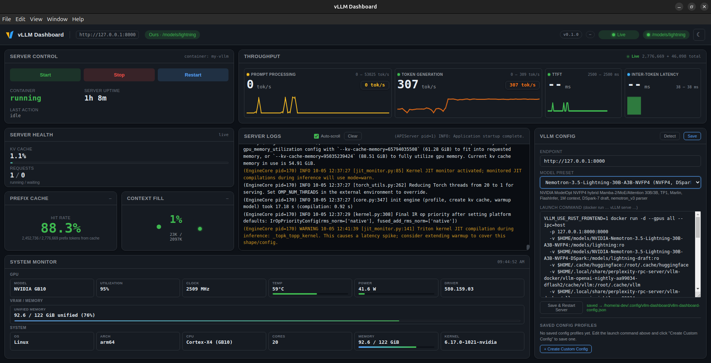
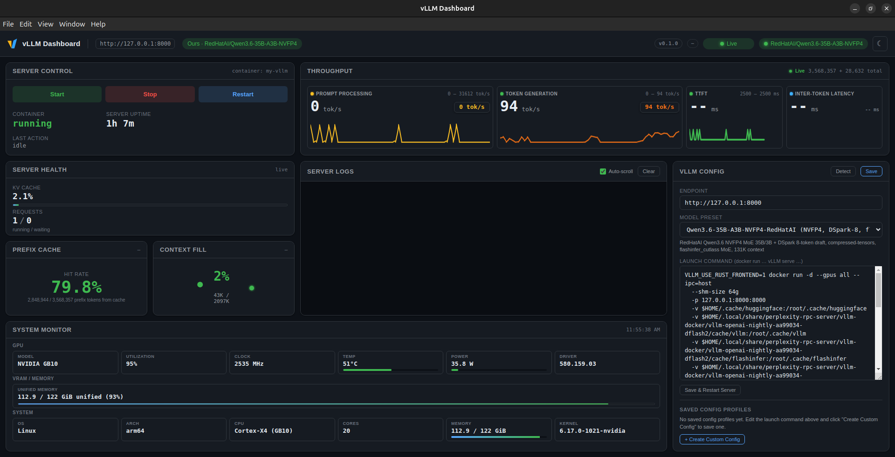

# vLLM Dashboard

A lightweight Electron desktop application for monitoring a local vLLM server in real-time.

## Features

- **Server Health** — Connection status, KV cache usage, running/waiting request counts
- **Throughput** — Live prompt and generation tokens/second (computed from Prometheus metrics)
- **Prefix Cache** — Cache hit rate percentage
- **Server Logs** — Live tail of `docker logs` (or file), color-coded with auto-scroll
- **System Monitor** — Live GPU telemetry (nvidia-smi + `/proc`) with GPU name, utilization, clock, temperature, power, VRAM, OS, CPU, RAM, kernel
- **Server Control** — Start / Stop / Restart the vLLM container from the dashboard
- **Monitor Mode** — Detects external servers (Ollama, other vLLM instances) and locks controls appropriately
- **Model Presets** — Pre-configured launch commands for common model configurations

## Screenshots

<!-- Add screenshots here for best results -->
<!-- Place images in a `docs/screenshots/` directory and link below -->

<table>
  <tr>
    <td align="center" width="45%"><a href="docs/screenshots/Nemotron-3.5-Lightning-30B-A3B-NVFP4.png"></a><br/><sub><b>Nemotron-3.5-Lightning-30B-A3B-NVFP4</b></sub></td>
    <td align="center" width="45%"><a href="docs/screenshots/RedHatAI/Qwen3.6-35B-A3B-NVFP4.png"></a><br/><sub><b>Qwen3.6-35B-A3B-NVFP4</b></sub></td>
  </tr>
</table>

## Requirements

| Requirement | Version | Notes |
|---|---|---|
| **OS** | Linux (x86_64 or ARM64) | AppImage packaging targets Linux. Other platforms may work but are untested. |
| **Node.js** | ≥ 18 | Build tooling — not required to run the AppImage. `sudo apt install -y nodejs npm` (Ubuntu/Debian) or `sudo dnf install -y nodejs npm` (Fedora/RHEL). |
| **Docker** | Any (with GPU support optional) | Required for container start/stop/restart and log tailing. `sudo apt install -y docker.io` (Ubuntu/Debian) or `sudo dnf install -y docker` (Fedora/RHEL). |
| **nvidia-smi** | Any | Required for the System Monitor panel (reads GPU metrics). Comes bundled with the NVIDIA driver. |

To **run** the dashboard you only need the built `.AppImage` — no Node.js or build tooling required.

## Build from Source

```bash
git clone https://github.com/datacron-dev/vllm-dashboard.git
cd vllm-dashboard

npm install        # installs electron (~300MB) + electron-builder
npm run build      # produces dist/vllm-dashboard-0.1.0-<arch>.AppImage
```

The AppImage bundles everything — Electron runtime, your app, and the icon — into a single self-contained binary that runs on any Linux x86_64 or ARM64 machine.

## Install as a Desktop Application

```bash
./install-desktop.sh
```

This script:

1. Copies the AppImage to `~/.local/bin/vllm-dashboard.AppImage` (stable path, on PATH)
2. Installs the app icon to `~/.local/share/icons/`
3. Writes a `.desktop` launcher to `~/.local/share/applications/`
4. Creates a wrapper script at `~/.local/bin/vllm-dashboard`
5. Refreshes the desktop database

After this, the app appears in your application menu and can be launched with `vllm-dashboard` from the terminal.

### Platform Notes

The installed launcher automatically passes:

| Flag | Why |
|---|---|
| `--no-sandbox` | Electron's SUID chrome-sandbox is not root-owned inside an AppImage. Safe here since the renderer is already isolated via `contextIsolation` + `sandbox: true`. |
| `--disable-gpu` | Prevents GPU process crashes on headless/SSH sessions. Set `VLLM_DASHBOARD_GPU=1` to re-enable. |

## Quick Start — Run the AppImage

If you already have a built AppImage (or downloaded one from a Release):

```bash
./vllm-dashboard.AppImage
```

Or after desktop installation (see above):

```bash
vllm-dashboard   # from your application menu or terminal
```

## Configuration

### Endpoints & Settings

Settings are persisted to `~/.config/vllm-dashboard/vllm-dashboard-config.json` on Linux. Edit them in the **vLLM Config** panel inside the app, or create the file manually:

```json
{
  "vllmEndpoint": "http://127.0.0.1:8000",
  "vllmCommand": "docker run -d ... vllm serve ...",
  "logSource": "docker",
  "dockerContainer": "my-vllm",
  "logFile": "/var/log/vllm.log",
  "pollIntervalMs": 2000
}
```

| Setting | Description |
|---|---|
| `vllmEndpoint` | The vLLM server's base URL (e.g. `http://127.0.0.1:8000`) |
| `logSource` | `"docker"` to tail `docker logs`, or `"file"` to read a log file |
| `dockerContainer` | Container name for start/stop/restart and log tailing |
| `logFile` | Path to a log file when `logSource` is `"file"` |
| `pollIntervalMs` | How often to poll the server (default 2000 ms) |

### Presets

The dashboard ships with model presets that auto-fill the `vllmCommand` with appropriate flags. Select one from the **vLLM Config** panel dropdown to switch between configurations.

## Architecture

```
vLLM Server ────────────────────────────────────────┐
    /metrics (Prometheus)                           │
    /v1/models (OpenAI-compatible)                  │
    /api/tags (Ollama)                              │
                                                    │
                                                    ▼
              ┌───────────────────────────┐
              │  vLLM Dashboard (Electron)  │
              │                           │
              │  electron/                 │  ← Main process
              │    main.js                 │    IPC, window, lifecycle
              │    metrics.js              │    Poll /metrics, parse
              │    logs.js                 │    Tail logs via spawn
              │    server-control.js       │    Docker exec + start/stop
              │    provenance.js           │    Detect Ours vs External
              │    system-monitor.js       │    nvidia-smi + /proc polling
              │                           │
              │  src/                      │  ← Renderer
              │    index.html              │    UI layout
              │    styles.css              │    Dark/light theme
              │    app.js                  │    Panel rendering
              └───────────────────────────┘
```

**Data flow:** The main process polls `/metrics` every 2 seconds, parses Prometheus text format, computes deltas (tokens/sec, hit rate), and pushes updates to the renderer via IPC. Logs are streamed via `docker logs -f` (or a file) with a 50-line/sec throttle.

## Panels

| Panel | What It Shows |
|---|---|
| **Server Control** | Start / Stop / Restart the vLLM container. Status badge and last-action log. |
| **Server Health** | KV cache usage bar, running/waiting request counts, last fetch time. |
| **Throughput** | Prompt tok/s and generation tok/s (delta over poll interval). |
| **Prefix Cache** | Cache hit rate (%) from prefix cache metrics. |
| **Server Logs** | Live tail of `docker logs` (or file). Color-coded (INFO/WARN/ERROR), auto-scroll, collapsible. |
| **vLLM Config** | Endpoint, launch command, model preset, poll interval. Save to disk. |
| **System Monitor** | GPU name, utilization, clock, temperature, power, VRAM. System: OS, arch, CPU, cores, RAM, kernel. |

## Troubleshooting

### Panels showing `--` while the server is healthy

1. Verify the endpoint in **vLLM Config** is correct: `http://127.0.0.1:8000` (the `/v1` suffix is stripped automatically).
2. Confirm metrics are accessible: `curl http://127.0.0.1:8000/metrics` should return HTTP 200.
3. Check that your vLLM version exposes the expected Prometheus metrics. Run:
   ```bash
   curl http://127.0.0.1:8000/metrics | grep -E '^(vllm|process):'
   ```
   If `vllm:gpu_cache_usage` is missing, the dashboard will also fall back to the legacy metric name.

### Start/Stop/Restart buttons are disabled (locked)

The dashboard detects whether the endpoint is controlled by **your** container or an **external** server. If an external server is found (e.g. another vLLM instance or Ollama on the same port), buttons are locked to prevent conflicts. This is expected behavior.

To resolve: stop the external server on the endpoint port, or change the endpoint in **vLLM Config** to your desired server.

### System Monitor shows no GPU data

Ensure `nvidia-smi` is on your PATH and accessible. The System Monitor polls nvidia-smi output every 3 seconds. Run `nvidia-smi` manually to verify it works.

### AppImage won't launch

Ensure you have the required dependencies installed. On most distros:
```bash
# Ubuntu/Debian
sudo apt install libfuse2  # or libfuse2t64 on newer systems

# Fedora/RHEL
sudo dnf install fuse-libs
```

## Development

```bash
# Run in development mode (auto-reload on file changes)
npm run dev

# Build for testing
npm run build

# Build unpacked directory (no AppImage wrapper)
npm run build:dir
```

Files watched for changes: `electron/**/*`, `src/**/*`, and `package.json`.

## License

MIT
